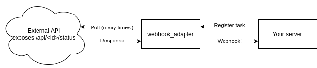

# webhook_adapter

A simple web server to add webhook functionality to websites that only expose a "normal" (i.e., polled) API.

It works by polling the target API and only sending a request to your server when the target API returns a certain response.

It was developed to allow [the AgroSmart application](https://github.com/IS-AgroSmart/AgroSmart-Web) to receive notifications from [the WebODM Lightning service](https://webodm.net) when a task is completed, since [it appears to not support webhooks](https://gitter.im/OpenDroneMap/web-development?at=597773761c8697534a5bbb0a), and AgroSmart uses webhooks to trigger some post-processing and notifications.

Below is an activity diagram of the adapter. Your server, which expects a webhook-style API, registers with the adapter to listen to an API endpoint. The `key` is expected to contain whatever data is required to inform the webhook adapter of the exact URL that it must watch. You should register with the webhook adapter just after sending the request for the long-running job to the remote API.

After registering, the adapter will start polling the URL (here, GET `/api/id/status`, where `id` is probably `key`). As long as the API response does NOT fulfill a specific condition (here, the`progress` key on the returned JSON is less than 100), the adapter simply waits for a while and polls again. Once the API response fulfills the condition, the adapter sends a single POST request back to your server, waits for an acknowledgement (a simple HTTP 200 OK status code will do), and deletes that watch from the list. From there on, your server can carry on as if the remote API had sent the webhook.

The adapter can (obviously) watch multiple URLs at the same time, all of them in parallel.

## Persistence

If the adapter process is stopped, webhooks will not be delivered (duh). However, all watched URLs will be persisted, so that the watches will resume once the process is restarted. 

Persistence is implemented with simple text files. Upon reception of a request to watch a URL, the adapter creates a text file with name equal to the key, and no content, in the `pending` directory. Therefore, there is always a file in the `pending` directory for each URL that is being watched. Files are deleted after successful delivery of the webhook to your server. Therefore (and ignoring for the sake of sanity the edge case on which the server crashes or is stopped after the webhook was delivered but before the file is deleted), it is very easy to recover from a process restart: simply list all files in the `pending` directory and recreate a task for each one of them.

